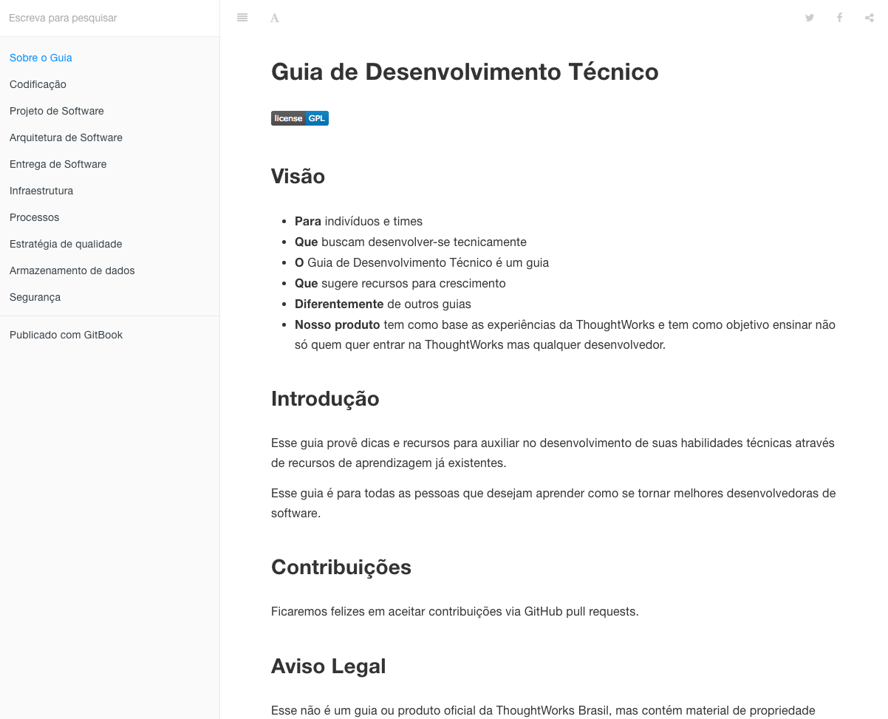
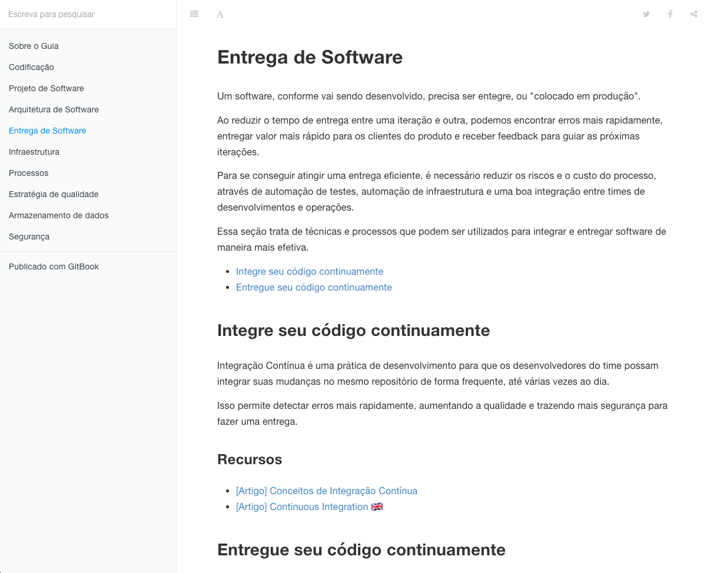

# Guia de Desenvolvimento Técnico

<h4 class="subtitle">Hora do Lanche</h4>

Note: apresentação

---

Senta que lá vem

## História

Note: vamos começar dando contexto

----

<ul>
  <li>Diferentes Formações</li>
  <li>Muito o que estudar</li>
  <li>Muitos recursos</li>
</ul>

Note:
Temos twers dos mais diversos backgrounds e formações. Muitos de nós não
tem formação formal em TI.

E mesmo sabendo que não importa para o papel que exercemos, entendemos
que existem diversas áreas que devemos estudar para realizá-lo bem.

Muitos recursos: livros, cursos online, blogs, vídeos. O que deixa muita
gente perdida.

----

 

Note:
Muitas pessoas estavam procurando o Marcos para falar sobre essas questões,
já que ele tanto falava de Capabilities e ele então juntou todo mundo numa
sala...

----

 
 
 
 
 
 
 
 
 
 

Note: ...e pediu para que pensássemos em ações para ajudar o escritório
nessa questão.
Dessa atividade surgiu algumas idéias, como workshops por exemplo, e a
que estamos aqui para falar é o Guia.

---

O que é o

## Guia?

Note: Agora sim!

----

Note: ler a visão

----

Note: falar um pouco dos tópicos

----

Note: falar da estrutura de um tópico: intro, sub tópicos e recursos

---

Faltou o tópico "X"!

Conheço um artigo muito bom!

## Como contribuir?

Note: público no github. não precisa ser PR, pode criar Issue.
Não precisa clonar, pode editar pelo github.

---

## Perguntas? Sugestões?

---

# Muito Obrigado!
